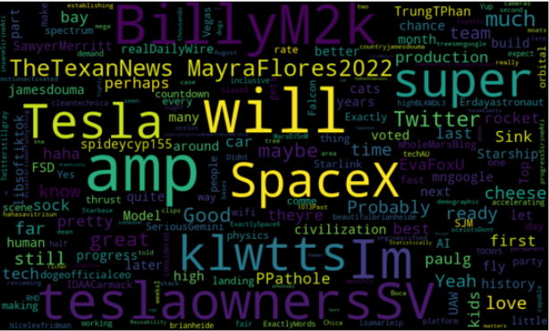

# To-The-Moon

## Topic:

  
  

Word cloud image. Generated from collection of twitter data retrieved for sntiment analysis.

* Effects of future Dogecoin value 

How Elon Musks tweets 

Tamara - Data Dump

create model based on sentiment analysis 

## Reason behind Topic

* We believe that there is causation to be found in the analysis of Elon Musk and the effect his tweets have on Dogecoin. Creating a model to predict 

## Description of Data Source

## Questions we hope to answer with Data

## Keeping in Mind

*Communication Protocals

*One branch per team member

*Atleast 4 commits per member by July 17th

## Current 7/7

Defining problem statement

other crypto and other influencer datasets (see if u guys can get all the required datasets by sat)

UI design

based on data understanding - what all fields are required to be stored?

model to use based on defining the main problem statement

