# To-The-Moon 
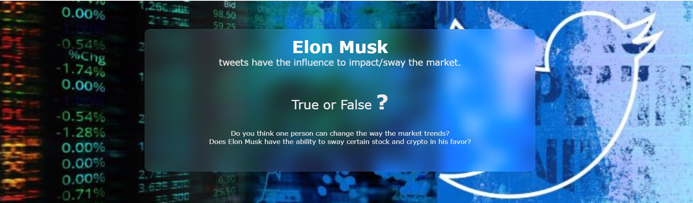

## Table of Contents
- [Project Overview](#OverviewProject)   
  * [Background](#Background)
  * [Questions We Hope to Answer with Data](#Questions)
  * [Approach](#Approach)
- [Data Exploration phase](#DataExp)
  * [Data Retrieval](#retrieval)
  * [Database Design](#dbDesign)
  * [Preprocessing of Data](#preprocessing)
- [Analysis Phase](#Analysis)
- [Machine Learning](#ML)
  * [Models used for Stock Prdiction](#stockPred)
  * [Models used for Stock Prdiction with Sentiment Score](#sentiPred)
- [Visualization](#visual)
- [Communication Protocols](#comm)
- [Technologies](#Technologies)
- [Resources](#Resources)

##  Project Overview

It has been observed that Elon Musk tweets have been impacting the Stocks and Cryptocurrency market. We wanted to analyze the impact of the tweets and how long the impact was holding true.
This project will predict the Stock/Crypto price for Tesla, Twitter and Dogecoin, and also show the impact of Elon's tweets on respective stock/crypto.

   

<!-- 
 <b> <i> </i></b>
 -->

###  Background 

In November of 2020, one of our teammates' family invested $500 into Doge Coin. At the time the coin was worth $0.002, not even one cent. In Feb 11th, at a price of $0.07, her family decided to sell having multiplied their monitary investment 35 times. 

**Under the influence of social media Doge Coin would continue to climb in price and reach $0.71 cents at its highest in May 6th of 2021, 355 times the price from November 2020.** The $500 could've have turned into $177,500, something most stocks couldn't do without social media. The value has since dropped close to the $0.07, the price at which her family sold the coin. 

In 2020 and 2021 Twitter, Reddit and Robin Hood changed the dynamics of the stock market and crypto currencies. Social media became a disruptive force in the economy. Yet **Doge could've just been one of many many crypto coins that did not rise in price, if it wasn't for one person that brought notoriety to this currency, Elon Musk.**  

Therefore we are embarking on a quest to find the influence Elon Musk tweet's have had over **Dogecoin, Tesla stock, and Twitter stock**. In the process we are interested in understanding how the use of language by a single individual with a large following, can influence the price of stocks and coins. 

 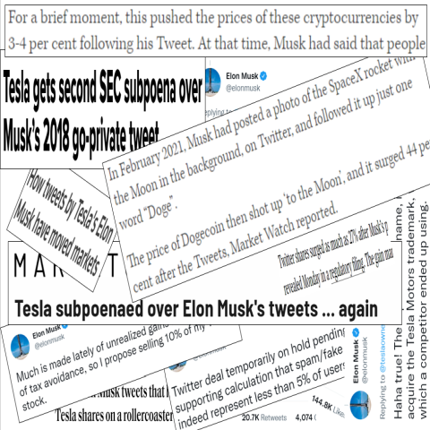

###  Questions we hope to answer with Data

Does Elon Musk have the ability to sway the market in his favor? With our data analysis and visualizations and after implementing machine learning algorithms we hope to answer the follwing questions:  

 1. Whether the sentiments of elon musks tweets affects the price in the short term of crypto and stocks 

 2. Prediction of DogeCoin/ Tesla/ Twitter for near future after related tweets.
 
 3. Impact of Elon Musk Tweets on DogeCoin/ Tesla/ Twitter.
 
 4. How long the impact (on the value of the stock/coin) stays in effect after the tweet.

###  Approach:

- Retrieving tweet data as well as stock data.
- Display the trends and also predict the stock prices and crypto price based on yahoo financial data. 
- Preprocessed the data dumps to clean data and store it into postgres database. 
- Used sentiment analysis to analyse the tweets as positive, negative or neutral.
- Used the sentiment analysis imputs to build a model for predicting the impact of the tweets on the near future stock price.
- Pull the data from database to create visualizations.

 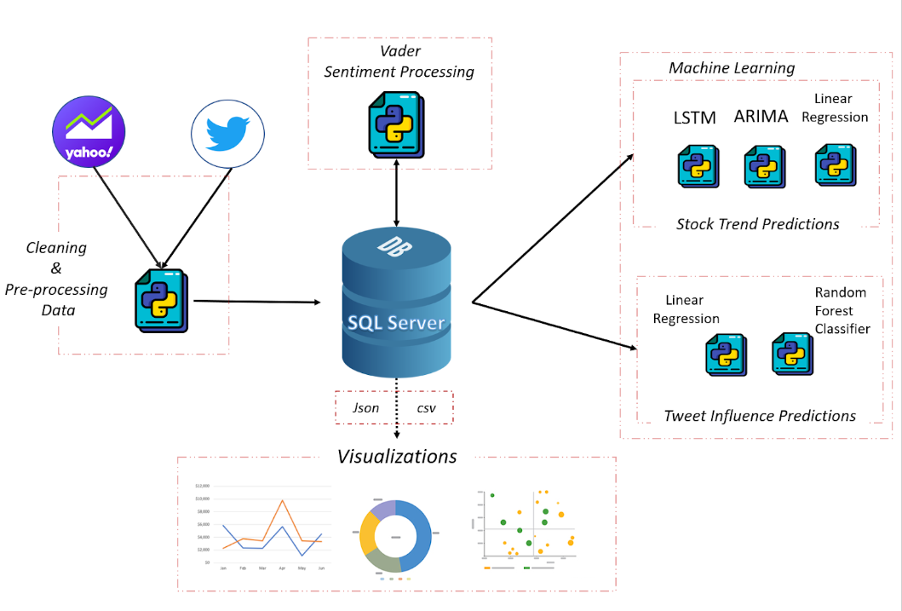 

 <b> <i> Fig.1 Proposed System</i></b>

##  Data Exploration Phase:
  
  During the data exploration phase the following steps are implemented:

- Retrieving tweet data as well as stock data
- Create a ER design of the database and then implement it
- EDA and Data Preprocessing - using Python
- Finally populate the database with the clean and preprocessed data.

###  Data retrieval

For our project we have prepared the data in the following ways:

- [Elon Musk Kaggle Data](Segment4_Delivery/Data_Resources) - Pulled the data from Kaggle, which contains a dump of Elon Musk tweets from 2010 to 2021. 
- [Code for scraping Twitter data](Segment4_Delivery/Data_Scraping/TwitterScrape_UserTimeLine.ipynb) - Used **Twitter API - Tweepy**, to get the latest tweets of Elon Musk in 2022. 
- [Code for scraping Stock price data from Yahoo Finance](Segment4_Delivery/Data_Scraping/Finance_data.ipynb) - Retrieved the stock price data for **Doge,Tesla,Twitter** using **Yahoo Finance API**.

###  Database Design

For our project, we are using a relational database - **Microsoft SQL Server**.
Below is the ER Diagram of the database:

 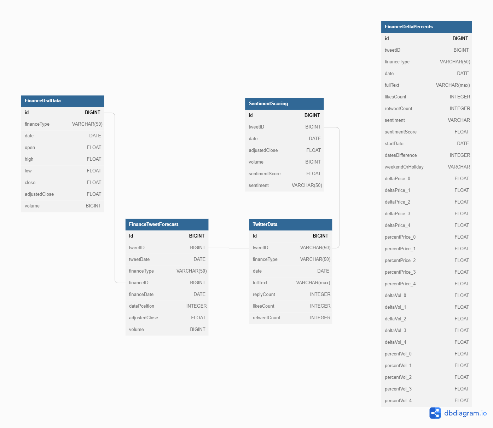 

 <b> <i> Fig.2 Entity–relationship Diagram</i></b>

**Stored procedures and SQL scripts** are used to populate, read/write to database. 
SQLConn.py - A wrapper class that interacts with Database and call these stored Procedures helps in reusing the code in every python program , without manually writing each command. Even If we have to change the database or extend the system to multiple databases, the only place we need to modify was a single file ie. SQLConn.py.
Hence, this can scale to multiple database support.

Click below to see the SQL Scripts :

[SQL Scripts for populating the database](Segment4_Delivery/SQL_SERVER_Scripts)

###  Preprocessing of Data

The scraped data from Twitter and Yahoo Finance, was first stored in CSVs. We read these csvs in our python programs and performed the below preprocessing steps:
1. Merged the twitter scraped data with the Kaggle data.
2. Renamed the columns to keep only matching ones.
3. Checked for null values.
4. Checked for duplicates and removed them.
5. Dropped the unnecessary columns and retrieved only the ones required for our analysis.
6. Formatted the date and changed it to datetime index.
7. Cleaned the tweets to make it more readable using Regex library in Python. We removed any special charactes like @,#. Also removed any URLs in the text.
8. The finance data for the stocks/ crypto was processed using Python program and then stored in the database.

Below is the link to the codes for preprocessing phase:

[Python notebooks for Preprocessing](Segment4_Delivery/Pre_Processing) 

##  Analysis Phase

After the preprocessing of the data we performed the following analysis: 
- Performed sentiment analysis on the tweets using the **NLTK Vader** library. VADER not only tells about the Positivity and Negativity score but also tells us about how positive or negative a sentiment is. After performing sentiment analysis on every tweet, we get a 'positive','negative','neutral',compound scores. We classified a tweet as Positive, if the compund score was > 1 and Negative if the compund score was < 1. 
- We analyzed the finance date to see current and past market trends for **Doge, Tesla and Twitter**.  
- We merged the Twitter data and the Finance data to analyze the stock/crypto price for seven days when the Elon Musk tweeted. We calculated a percentage change in price for these 7 days. 
- Now it was the time to choose the machine learning models to predict and stock prices and also to predict an impact on stock price of Elon Musk tweet.

**One of the charts created in tableau to show sentiment scoring as well as the respective tweet(stacked tweets indicate multiple tweets on that particular day).**

<b><i> Fig.3 Elon's Tweets for Doge,Tesla and Twitter</i></b>

##  Machine Learning

We have implemented machine learning models to do the following:
1.	Prediction of Stock Prices
2.	Predict of impact of Elon’s tweets on stock prices.

###  Models used for Stock Prdiction

The first step that was performed before training the models was to fetch the values for **Tesla, Twitter and Doge** using **Yahoo Finance API** and store then in our SQL database. Following information is extracted for every stock - Date, Open, High, Low, adjustedClose, Volume. Before fitting our model, we preprocessed the data tried to visualize the data with the help of graphs.

Following models have been implemented for predicting the stock price:
1. Linear Regression
2. Arima (AutoRegressive Integrated Moving Average)
3. LSTM (Long Short Term Memory)

**Linear Regression:**

Linear regression is a linear model, e.g. a model that assumes a linear relationship between the input variables (x) and the single output variable (y). 
For predicting stock prices, we started with creating a **base model with Linear Regression**. We train a simple linear regression model using a 10-day exponential moving average as a predictor for the closing price. The ‘Date’ column will be converted to a DatetimeIndex and the ‘Adj Close’ will be the only numerical values we keep, while dropping the rest of the columns. 

**ARIMA (AutoRegressive Integrated Moving Average):**

After Linear Regression, we implemented a time series model – Arima. It is a form of regression analysis that gauges the strength of one dependent variable relative to other changing variables.

**LSTM (Long Short Term Memory):**

It is a variety of recurrent neural networks (RNNs) that are capable of learning long-term dependencies, especially in sequence prediction problems. LSTM has feedback connections, i.e., it is capable of processing the entire sequence of data, apart from single data points such as images. LSTMs help solve exploding and vanishing gradient problems.

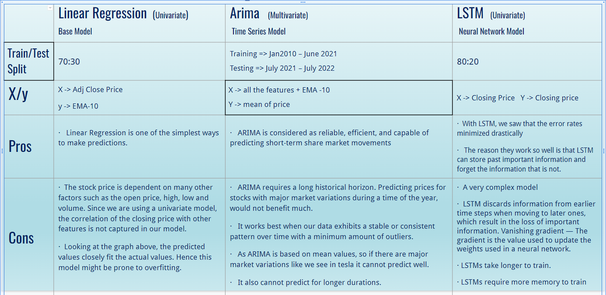

<b><i> Fig.4 Model Comparison for Stock Price Prdictions </i></b>

**Error Metric Comparison for all the Models:**

 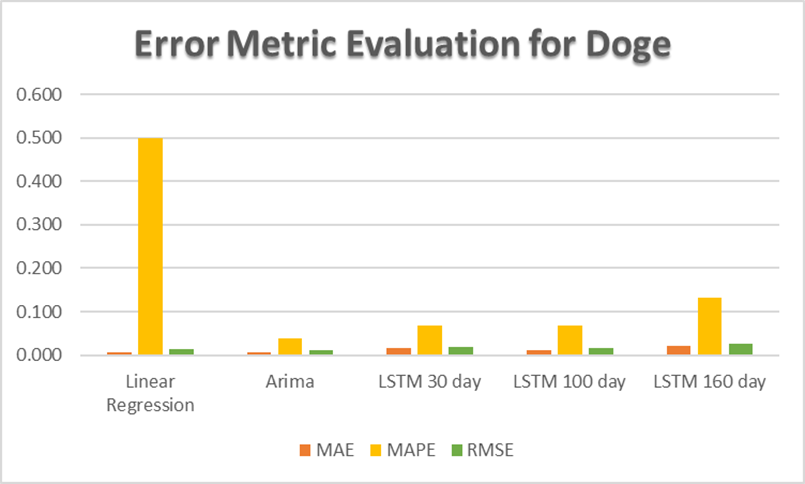 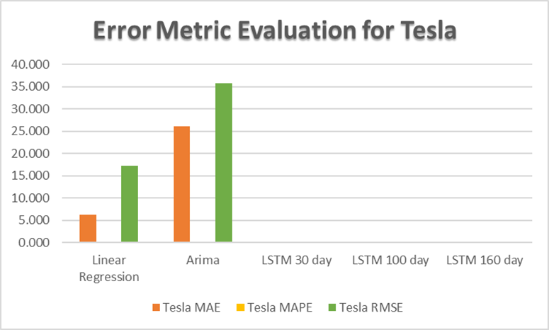

 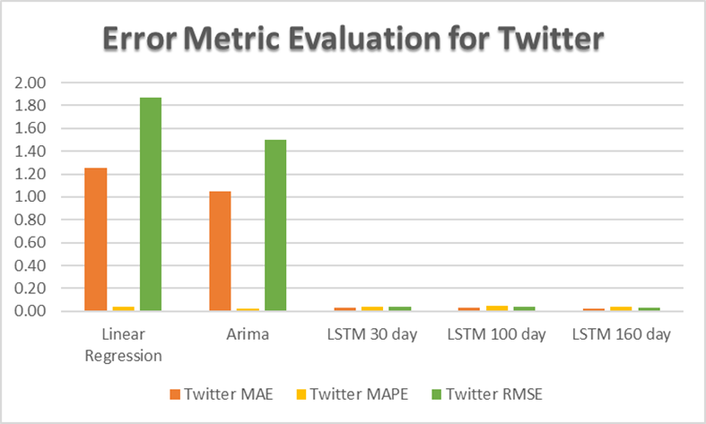

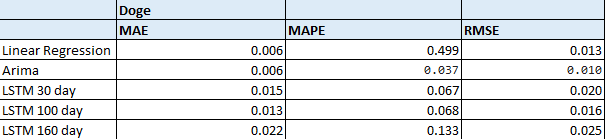 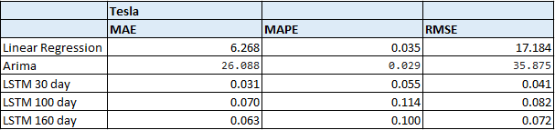

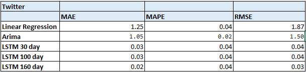

<b><i> Fig.5 MAE, MAPE, RMSE values comparison for Doge,Tesla,Twitter</i></b>

**Conclusion:**

To summarize, we started with the prediction of the closing price of a stock/cryptocurrency with a univariate model – Linear Regression. Several features were visualized with the help of graphs and the data was preprocessed for the machine learning models. We have implemented 3 different machine learning models – Linear Regression, ARIMA, LSTM. 

The possible ways to improve every model is:

-	Implement a multivariate model for Linear Regression as the stock price is dependent on various other factors.
-	Implement a multivariate LSTM model. Also, understand the learning rate and create a customized function for our model to work better.
- Implement an ensemble model by integrating Arima and LSTM.

Below is the link to all the Machine Learning notebooks:

[Machine Learning Jupyter Notebooks](Segment4_Delivery/Machine_Learning)

###  Models used for Stock Prdiction with Sentiment Score and Twitter Engagement Data

**Multi-Variable Linear Regression:**

In this multivariable linear regression we attempted to predict the percentage increase and decrease of a stock or coin value based on the tweet's sentiment analysis, the tweet's data engagement such as the likes and retweets the tweet received, and the initial percentage change. 

The first step to get this data analyzed required getting the percentage changes in the stock's closing price and the trading volume. This data was calculated by taking the closing price and volume records prior to the tweet occuring, and then getting the percentage change with respect to these values for the following week. In Figure 6 we can see the start date as the date from which the initial value ocurred. The model is built for predicting the value dor Day 2, Day 3 and Day 4. We did not build a model for Day 1 as the tweet time was not taken into consideration, so the tweet could have ocurred after the stock price was closed. Day 1's percentage is therefore used as an input as well. When we are predicting for Day 3, we take Day 1 &2 's price percentages as inputs. When we are predicting for Day 3, we take Day 1, 2 & 3's price percentages as inputs. 

 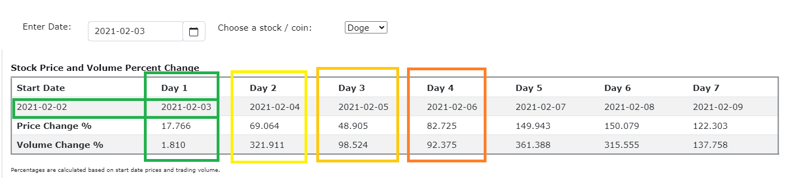

<b><i> Fig.6 Example of Tweet Price Percentage Table </i></b>

In some cases, there were multiple tweets that had the same "Start Date". We took the average of the sentiment scores for those, and then had two different approaches for the tweet's likes and retweets. In one, we had the average of those variables and included a column with the count of tweets. In another, we added tweet likes together for all the tweets pertaining to those days, and added the retweet counts together as well. Finally we determined that the method with averaging the tweet likes, averaging the retweets and including the count of tweets worked the best. 

Our data determined that there seems to be somewhat of a linear relationship, and therefore the percentages can be predicted, for Tesla and Twitter models as the coefficients of determination neared 1. This means that with an input of the initial percentage change, and the tweet's engagement and sentiment analysis we could determine a percentage change, and using that result, feed it to the next model to predict the following's day percentage change, and so on. 

For Doge, the relationship did not seem to be as clearly shown, with the coefficient being erratic for the different dates. One of the reasons could be, how extreme the percentage changes have been at times for Doge, the other one could be sample size being much smaller than the other two coins. When the data for all stocks were combined, it resulted on the coefficients improving with respect to Doge's but getting worse with respect to Tesla's and Twitter's.

 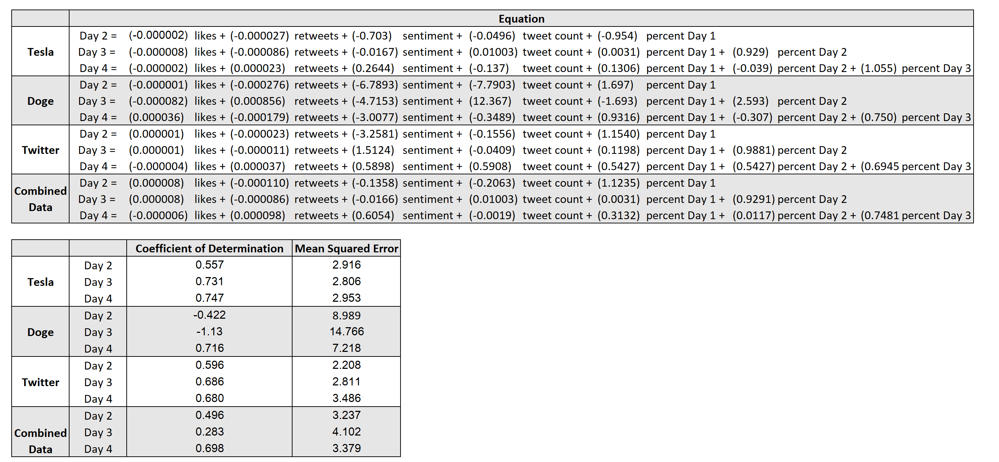

<b><i> Fig.7 Multi - Linear Results </i></b>

In the future, this model has to have the multilinear regression assumptions validated, including some potential data transformations. In a setting where we would have access to more monetary resources, other sources such as the overall twitter population, reddit data, and news data should be included in the model. Overall, this should not be considered a final model and should continue to be refined. Although linear regression might have been a good starting point for this model, there might be other machine learning models that would work better for this data.

[Jupyter Notebook for Calculating Percentages](Segment4_Delivery/Pre_Processing/Delta_Percentage_Analysis.ipynb) 
[Jupyter Notebook for Percentage Prediction with Sentiment Score and Twitter Engagement Data](Segment4_Delivery/Percentages) 

**Random Forrest Classifier:**

##  Visualization

We have chosen the below technologies to showcase our project:

- Tableau
- Website 

We have deployed our website on Heroku and Github.

##  Communication Protocols

We worked as a team in every phase of the project. But to work effectively we used the following tools to regularly communicate to each other:
- **Slack/Wattsapp** - Slack channel was our immediate way of messaging and communicating with each other.
- **Github** - We created a repository on Github and created a branch for each member. Also we created a folder in the "Main" branch for each member to regularly put our updated codes and eventually merge them with the main branch.
- **Zoom Calls** - We met regularly on zoom to update each other on the tasks each one of us was working on. This was the best time to motivate each other and also hvae some fun together. 

 ##  Technologies
 
 

##  Resources

[1] **Data Files:**  
- [Kaggle Data](Segment4_Delivery/Data_Resources)  

[2]**SQL Server Scripts**  
- [SQL Scripts for database](Segment4_Delivery/SQL_SERVER_Scripts)  

[3] **Scraping Codes:**  
- [Twitter and Yahoo Scrape Code](Segment4_Delivery/Data_Scraping)  

[4] **Data Preprocessing**  
- [Jupyter Notebooks for preprocessing](Segment4_Delivery/Pre_Processing)  

[5] **Machine Learning Codes**  
- [Jupyter Notebooks for Machine Learning](Segment4_Delivery/Machine_Learning) 
- [Jupyter Notebook for Percentage Prediction with Sentiment Score and Twitter Engagement Data](Segment4_Delivery/Percentages) 

[6] **Visualization Codes**  
- [Java Script and HTML File](Segment4_Delivery/Visualization)  
- [Visualization Discussion](https://github.com/VanAntworth/To-The-Moon/blob/main/Resources/Visualizations.docx)   
- [Visualization Dashboard](https://github.com/VanAntworth/To-The-Moon/tree/main/Segment2_Delivery/Visualization)  

